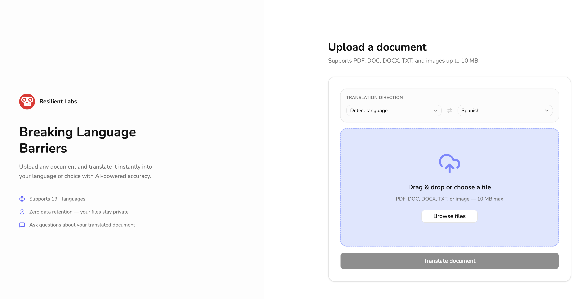
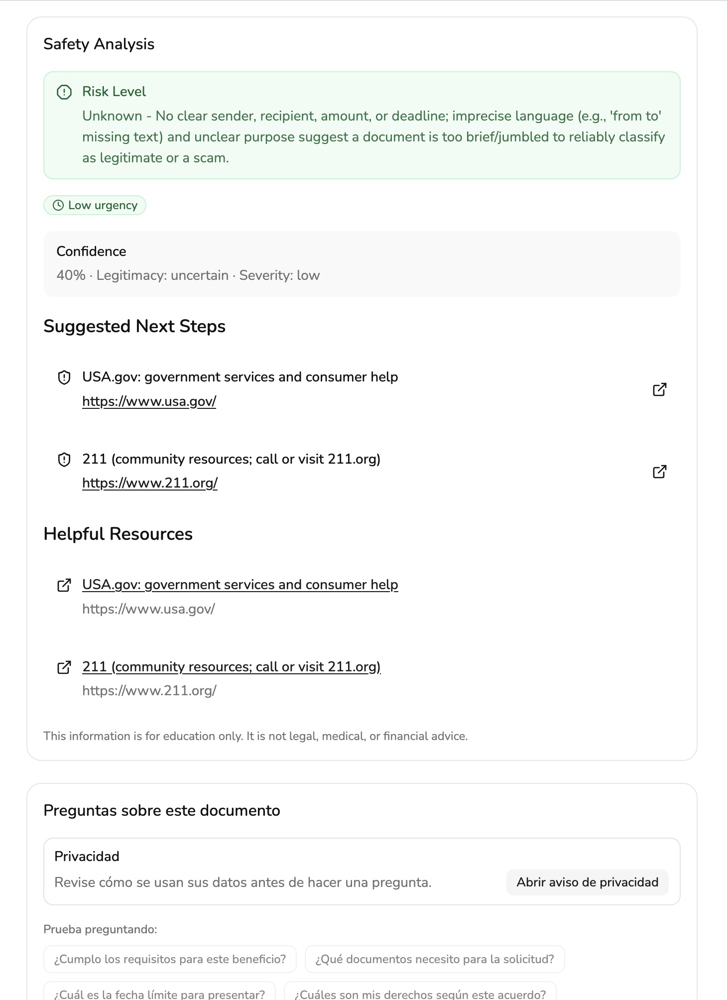

# Multilingual AI Document Assistant

*Browser-local EntityDB/IndexedDB storage and embeddings, plus a stateless backend for translation, summarization, and citation-grounded Q&A—zero server-side document retention.*

**Privacy-first** and **zero-retention** by design: built for users who rely on translating and making sense of **English-language documents**, it layers translation, summarization, and **RAG-grounded Q&A** so answers trace back to their own pages—not web-scale guesswork—via a multi-model backend. Text is processed on demand and **never stored on servers**; whatever persists stays in the **user’s browser (EntityDB)**. The backend stays **stateless** end to end.

**Key points:**

- **EntityDB** — IndexedDB under the hood + Transformers.js for embeddings and semantic search
- **Stateless API pattern** — routes process and return results without database persistence

---




---

## Live Demo

[Vercel Deployment](multilingual-ai-document-assistant.vercel.app)

## Local Setup

### Quick start (copy & paste)
*Warning: Still needs .env.local variables*

```bash
git clone https://github.com/Resilient-Labs/multilingual-ai-document-assistant.git
cd multilingual-ai-document-assistant
npm install
npm run build
npm run dev
```

Then open http://localhost:3000

---
### In-Depth directions

#### 1. Clone the repository

```bash
git clone https://github.com/Resilient-Labs/multilingual-ai-document-assistant.git
cd multilingual-ai-document-assistant
```

#### 2. Install dependencies

```bash
npm install
```

#### 3. Optimize the build

```bash
npm run build
```

#### 4. Environment variables

Optional. Copy `.env.local.example` to `.env.local` when you add OCR, LLM, or other API keys:

```bash
cp .env.local.example .env.local
```

#### 5. Run the development server

```bash
npm run dev
```

Open http://localhost:3000 in your browser.

#### 6. Verify setup

- The app should load without errors.
- API routes are stateless — they process and return; no server storage.
- Read Aloud requires `HF_TTS_SPACE_URL` to be set (see [Text-to-Speech](#text-to-speech--read-aloud)).
- Translation (non-English targets) requires `HF_TRANSLATE_SPACE_URL` pointing at the NLLB Gradio Space.
- Safety route may require `OPEN_ROUTER_API_TOKEN` if used.

### Troubleshooting

| Issue                             | Solution                                                                      |
| --------------------------------- | ----------------------------------------------------------------------------- |
| Port 3000 in use                  | Run `npm run dev -- -p 3001` to use a different port                          |
| Build fails                       | Run `npm ci` for a clean install, then `npm run build`                        |
| EntityDB / Transformers.js errors | Check `next.config.js` has webpack aliases for `onnxruntime-node` and `sharp` |
| Translation fails                 | Verify `HF_TRANSLATE_SPACE_URL` is set to the NLLB Gradio Space base URL Free Spaces sleep after ~48h idle; the first request after sleep can take 30–60s while it cold-starts, and the route waits up to 180s for the full round-trip. `HF_TOKEN` is optional for Translate. |
| Read Aloud fails                  | Confirm `HF_TTS_SPACE_URL` is set and the Space is reachable. Cold starts after idle can take 30–60s. Read Aloud is only offered for English, Spanish, and Vietnamese. |
| Upload rejected around 5–10MB     | Backend limit is 4.5MB `(lib/constants.ts)`                                   |

## Architecture: Zero-retention

```
User Browser
│
├── EntityDB (IndexedDB + Transformers.js)
│   Entities: Document, OCRBlock, Chunk, Embedding, Summary, ChatSession, ChatMessage, RiskFlag, Language
│
└── API requests
     │
     ▼
Stateless Backend (OCR, LLM, embeddings, translation, risk classification)
```

**Server never stores documents.** Everything persistent lives in EntityDB in the browser.

---

## Storage limits

- PDF / Images: ≤ 4.5 MB (client upload limit)

---

## Architecture docs

- [EntityDB (GitHub)](https://github.com/babycommando/entity-db)