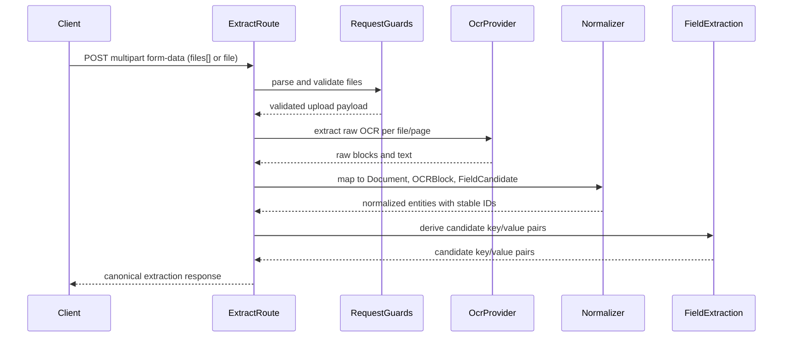

## Team 1 OCR API Documentation

### POST /api/documents/extract

Stateless OCR extraction endpoint. Accepts document files, validates them, runs OCR, normalizes the output, and returns entity-ready JSON for frontend persistence in EntityDB.

#### Request

- **Content-Type**: `multipart/form-data`
- **Body**: `files[]` (multiple files) or `file` (single file)

**Constraints:**

| Constraint | Value |
|------------|-------|
| Max file size | 4.5 MB per file |
| Max files per request | 10 |
| Allowed MIME types | `application/pdf`, `image/jpeg`, `image/png`, `image/webp` |

**Example request:**

```bash
curl -X POST http://localhost:3000/api/documents/extract \
  -F "files=@document1.pdf" \
  -F "files=@document2.png"
```

#### Response

**Success (200):**

```typescript
interface ExtractionResponse {
  document: {
    id: string;           // e.g. "doc_abc123"
    filename: string;
    mimeType: string;
    sizeBytes: number;
    createdAt: number;    // Unix timestamp
  };
  ocr: {
    documentId: string;
    fullText: string;
    blocks: Array<{
      id: string;         // e.g. "block_xyz789"
      documentId: string;
      text: string;
      confidence?: number;
      page?: number;
      bbox?: {            // Normalized 0-1 coordinates
        x: number;
        y: number;
        width: number;
        height: number;
      };
    }>;
    language?: string;
  };
  files: Array<{
    fileIndex: number;
    filename: string;
    mimeType: string;
    sizeBytes: number;
    pages: Array<{
      pageNumber: number;
      width: number;
      height: number;
      blocks: OCRBlock[];
    }>;
  }>;
  fieldCandidates: Array<{
    id: string;           // e.g. "field_def456"
    documentId: string;
    blockId?: string;
    key: string;
    value: string;
    confidence?: number;
  }>;
  extractedAt: number;    // Unix timestamp
}
```

**Error (400/500):**

```typescript
interface ExtractionErrorResponse {
  error: string;
  code: "NO_FILES" | "INVALID_FILE_TYPE" | "FILE_TOO_LARGE" | "TOO_MANY_FILES" | "OCR_FAILURE" | "INTERNAL_ERROR";
  details?: Record<string, unknown>;
}
```

#### Normalized Bounding Box

All `bbox` coordinates are normalized to the 0-1 range relative to page dimensions:

- `x`: Left edge position (0 = left, 1 = right)
- `y`: Top edge position (0 = top, 1 = bottom)
- `width`: Width as fraction of page width
- `height`: Height as fraction of page height

This allows the frontend to render boxes at any display size without knowing original page dimensions.

#### Stable IDs and Relationships

The response includes stable IDs for frontend persistence:

- `document.id`: Root document identifier (format: `doc_{uuid}`)
- `ocr.blocks[].id`: Block identifier (format: `block_{uuid}`)
- `ocr.blocks[].documentId`: Links block to parent document
- `fieldCandidates[].id`: Field candidate identifier (format: `field_{uuid}`)
- `fieldCandidates[].documentId`: Links candidate to parent document
- `fieldCandidates[].blockId`: Links candidate to source block

The frontend can directly persist `Document`, `OCRBlock`, and `FieldCandidate` records with these IDs and relationships.

#### Sequence Diagram



#### Non-Goals

- **No server persistence**: The server does not store uploaded files, OCR text, or entity records
- **No EntityDB writes on server**: EntityDB is browser-only; all persistence happens in the client
- **No long-lived document records**: Each request is stateless; the server forgets everything after responding

#### Testing

Run the test suite:

```bash
npm run test
```

Tests cover:

- Valid upload (single and multiple files)
- Invalid file type rejection
- Oversized file rejection
- Too many files rejection
- OCR failure handling
- Normalized response shape validation

---
