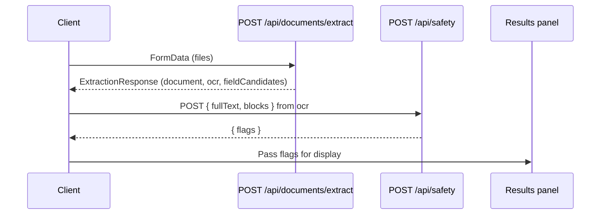

# Team 5 Safety API Documentation

### POST /api/safety

Stateless safety/risk analysis endpoint. Accepts document text or OCR blocks, returns risk flags.

#### Request

- **Content-Type:** `application/json`
- **Body:** `{ fullText?: string, blocks?: Array<{ text: string; confidence?: number }> }`

At least one of `fullText` or `blocks` must be provided. If both are present, `fullText` takes precedence.

**Example with fullText:**

```bash
curl -X POST http://localhost:3000/api/safety \
  -H "Content-Type: application/json" \
  -d '{"fullText": "FINAL NOTICE: Payment of $500 due within 7 days. Failure to pay may result in legal action."}'
```

**Example with blocks (Team 1 extract format):**

```bash
curl -X POST http://localhost:3000/api/safety \
  -H "Content-Type: application/json" \
  -d '{
    "blocks": [
      {"text": "FINAL NOTICE", "confidence": 0.95},
      {"text": "Payment due within 7 days.", "confidence": 0.9}
    ]
  }'
```

#### Response

**Success (200):**

```typescript
interface SafetyAnalysisResponse {
  flags: {
    category: string // e.g. "Debt Collection Letter", "Medical Bill", "Unknown"
    severity: 'low' | 'medium' | 'high'
    explanation?: string // One to two sentences with evidence from the document
    detectedAt: number // Unix timestamp (server-set)
  }
}
```

**Error (400):**

- Missing or empty `fullText` and `blocks` → `{ error: "fullText or blocks (with text) required", code: "VALIDATION_ERROR" }`
- Invalid JSON → `{ error: "Invalid JSON body", code: "VALIDATION_ERROR" }`

**Error (500):**

- `CONFIG_ERROR` — OPEN_ROUTER_API_TOKEN not set
- `EXTERNAL_ERROR` — OpenRouter API request failed
- `PARSE_ERROR` — Model returned invalid JSON
- `INTERNAL_ERROR` — Other server error

---

## Integration with Team 1 Extract

After `POST /api/documents/extract` returns, the client receives `ExtractionResponse` with `ocr: OCRResult`. Map it to the safety API:

| Extract field  | Safety API input                       |
| -------------- | -------------------------------------- |
| `ocr.fullText` | `fullText`                             |
| `ocr.blocks`   | `blocks` (each `{ text, confidence }`) |

**Client helper:** Use `analyzeDocumentSafety(ocr)` from `@/lib/safetyClient`:

```ts
import { analyzeDocumentSafety } from '@/lib/safetyClient'

const response = await fetch('/api/documents/extract', {
  method: 'POST',
  body: formData,
})
const { ocr } = await response.json()
const { flags } = await analyzeDocumentSafety(ocr)
```

**React hook:** Use `useSafetyAnalysis(ocr)` from `@/hooks/useSafetyAnalysis`:

```ts
import { useSafetyAnalysis } from '@/hooks/useSafetyAnalysis'

const { flags, loading, error } = useSafetyAnalysis(data?.ocr ?? null)
```

---

## For Downstream Consumers

| Teammate                | Use case                               | Fields to use                                              |
| ----------------------- | -------------------------------------- | ---------------------------------------------------------- |
| **Naima** (next steps)  | Map categories to recommended actions  | `flags.category`, `flags.severity`                         |
| **Justin** (confidence) | Extend response with confidence scores | Response type in `@/types` — add `confidence` when ready   |
| **Brandi** (results UI) | Display flags to user                  | `flags` via `analyzeDocumentSafety` or `useSafetyAnalysis` |

**Category reference:** See `SAFETY_DOCUMENT_CATEGORIES` in `@/lib/safetyConstants` for the list of document types the model may return.

---

## Sequence Diagram


