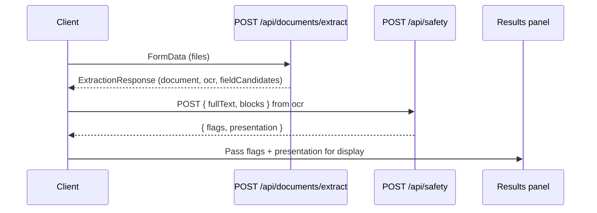

# Team 5 Safety API Documentation

### POST /api/safety

Stateless safety/risk analysis endpoint. Accepts document text or OCR blocks, returns risk flags.

#### Request

- **Content-Type:** `application/json`
- **Body:** `{ fullText?: string, blocks?: Array<{ text: string; confidence?: number }> }`

At least one of `fullText` or `blocks` must be provided. If both are present, `fullText` takes precedence.

**Example with fullText:**

```bash
curl -X POST http://localhost:3000/api/safety \
  -H "Content-Type: application/json" \
  -d '{"fullText": "FINAL NOTICE: Payment of $500 due within 7 days. Failure to pay may result in legal action."}'
```

**Example with blocks (Team 1 extract format):**

```bash
curl -X POST http://localhost:3000/api/safety \
  -H "Content-Type: application/json" \
  -d '{
    "blocks": [
      {"text": "FINAL NOTICE", "confidence": 0.95},
      {"text": "Payment due within 7 days.", "confidence": 0.9}
    ]
  }'
```

#### Response

**Success (200):**

```typescript
interface SafetyAnalysisResponse {
  flags: {
    category: string // e.g. "Debt Collection Letter", "Medical Bill", "Unknown"
    severity: 'low' | 'medium' | 'high' | 'urgent'
    riskLevel?: 'low' | 'medium' | 'high' | 'urgent' // from model; defaults to severity if omitted
    confidence?: number // 0–100 from model; drives low-confidence resource path when present
    legitimacy?: 'likely_legitimate' | 'uncertain' | 'likely_scam'
    explanation?: string // One to two sentences with evidence from the document
    detectedAt: number // Unix timestamp in ms when the server finished analysis
    evidenceCharOffset?: number // 0-based index in analyzed text (from the model)
    nextSteps: Array<{
      label: string
      type: 'phone' | 'url' | 'info'
      value?: string
    }> // Deterministic templates from category, severity, confidence, legitimacy (server rule engine)
  }
  presentation: {
    headline: string
    severityLabel: string
    summary: string | null // always null from API; client may merge Team 2 Summary
    primaryActions: Array<{ label: string; type: 'phone' | 'url' | 'info'; value?: string }>
    resources: Array<{ label: string; type: 'phone' | 'url' | 'info'; value?: string }> // url + phone subset
    disclaimer: string
  }
}
```

---

## Category buckets and next-step rules (Team 5)

Curated links live in `lib/data/safetyResources.json` and are selected by **`normalizeCategoryToBucket`** in `@/lib/safetyRecommendations` (re-exported from `@/lib/safetyNextSteps`). Model **`category`** strings are matched with substring heuristics (e.g. lease/rental → **housing**, medical/Medicare → **medical**, court/summons → **legal**, IRS/debt/bank → **financial**); anything else → **general**.

| Bucket    | Typical model categories (examples)                          |
| --------- | ------------------------------------------------------------- |
| housing   | Lease Agreement, eviction/rental wording                      |
| financial | IRS Tax Notice, Debt Collection, Bank Statement, utility bill |
| medical   | Medical Bill, EOB, hospital                                     |
| legal     | Court Summons, subpoena                                         |
| general   | Unknown, Promotional, no match                                |

**Urgent prefix:** For **`severity`** `high` or `urgent`, an informational lead-in step is prepended (deadlines and keeping copies). See `urgentPrefix` in the JSON bank.

**Low confidence:** If the model sends **`confidence`** below `SAFETY_CONFIDENCE_LOW` (40) in `@/lib/safetyConstants`, resources use the **general** bucket and a **verify via official website** info step is added—avoid trusting numbers/links that appear only on the document.

**Legitimacy / scam:** If **`legitimacy`** is **`likely_scam`**, FTC report-fraud and IC3 steps are prepended. When confidence is at least **`SAFETY_CONFIDENCE_MIN_FOR_SCAM_RESOURCE_ADJUSTMENT`** (55), institution-specific phone lines (e.g. IRS) are omitted from the **financial** bucket so the UI does not imply a suspicious letter is official.

**Prompt categories:** Align with `SAFETY_DOCUMENT_CATEGORIES` in `@/lib/safetyConstants` where possible; the bucket mapper is substring-based, not a strict enum match.

**Persistence (zero-retention):** Store `{ flags, presentation }` on the client (e.g. `CanonicalDocument.safety`) after extract + safety resolve; see `types/CanonicalDocument.ts`.

**Error (400):**

- Missing or empty `fullText` and `blocks` → `{ error: "fullText or blocks (with text) required", code: "VALIDATION_ERROR" }`
- Invalid JSON → `{ error: "Invalid JSON body", code: "VALIDATION_ERROR" }`

**Error (500):**

- `CONFIG_ERROR` — OPEN_ROUTER_API_TOKEN not set
- `EXTERNAL_ERROR` — OpenRouter API request failed
- `PARSE_ERROR` — Model returned invalid JSON
- `INTERNAL_ERROR` — Other server error

---

## Integration with Team 1 Extract

After `POST /api/documents/extract` returns, the client receives `ExtractionResponse` with `ocr: OCRResult`. Map it to the safety API:

| Extract field  | Safety API input                       |
| -------------- | -------------------------------------- |
| `ocr.fullText` | `fullText`                             |
| `ocr.blocks`   | `blocks` (each `{ text, confidence }`) |

**Client helper:** Use `analyzeDocumentSafety(ocr)` from `@/lib/safetyClient`:

```ts
import { analyzeDocumentSafety } from '@/lib/safetyClient'

const response = await fetch('/api/documents/extract', {
  method: 'POST',
  body: formData,
})
const { ocr } = await response.json()
const { flags, presentation } = await analyzeDocumentSafety(ocr)
```

**React hook:** Use `useSafetyAnalysis(ocr)` from `@/hooks/useSafetyAnalysis`:

```ts
import { useSafetyAnalysis } from '@/hooks/useSafetyAnalysis'

const { flags, presentation, loading, error } = useSafetyAnalysis(
  data?.ocr ?? null
)
```

---

## For Downstream Consumers

| Teammate                | Use case                               | Fields to use                                              |
| ----------------------- | -------------------------------------- | ---------------------------------------------------------- |
| **Naima** (next steps)  | Curated actions (server rule engine)   | `flags.nextSteps`, `flags.category`, `flags.severity`, `flags.confidence`, `flags.legitimacy` |
| **Justin** (confidence) | Confidence in UI / persistence         | `flags.confidence`, `flags.riskLevel`                     |
| **Brandi** (results UI) | Structured display                     | `presentation` (headline, severityLabel, primaryActions, resources, disclaimer) plus `flags` as needed |

**Category reference:** See `SAFETY_DOCUMENT_CATEGORIES` in `@/lib/safetyConstants` for the list of document types the model may return.

---

## Sequence Diagram


```mermaid
sequenceDiagram
    participant Client
    participant ExtractAPI as POST /api/documents/extract
    participant SafetyAPI as POST /api/safety
    participant BrandiUI as Results panel

    Client->>ExtractAPI: FormData (files)
    ExtractAPI-->>Client: ExtractionResponse (document, ocr, fieldCandidates)
    Client->>SafetyAPI: POST { fullText, blocks } from ocr
    SafetyAPI-->>Client: { flags, presentation }
    Client->>BrandiUI: Pass flags + presentation for display
```
